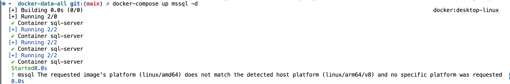
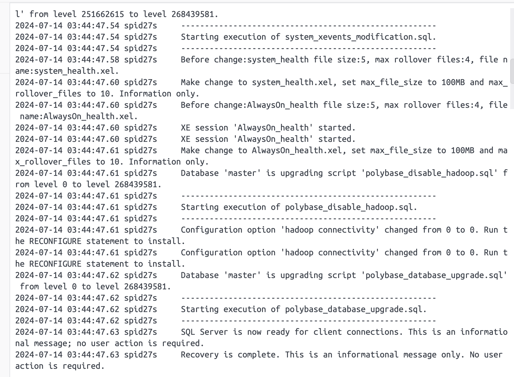

# docker-data-all

### Tool database management
- MySQL: MySQL Workbench
- MSSQL: Azure Data Studio

### MySQL

- MySQL version: 9.0.0
- Psw root: `AnhIT@ngugat`
- Fist Data: `anhit`
- Run command:
  ```
  docker-compose -f mysql.yml up -d
  ```
  or run from docker-compose.yml with old version.

### Start MSSQL use Docker-compose (map-volume)

MSSQL Version: `2022-latest`

**Step 1:** Run command deploy mssql docker:

```

docker run -e "ACCEPT_EULA=Y" -e "SA_PASSWORD=YourStrongPassword123" -p 1433:1433 --name sql-server -d mcr.microsoft.com/mssql/server:2022-latest
```

P/S: Lúc này đã có thể sử dụng được MSSQL, tuy nhiên sẽ không thể tuỳ chỉnh cho database, và restart lại container sẽ mất data.

**Step 2:** Tạo thư mục chứa data mssql

```
mkdir -p ./mssql
```

**Step 3:** Để chép data file của mssql cần stop container này

```
docker stop sql-server
```

copy datafile từ container ra

```
docker cp sql-server:/var/opt/mssql/data ./mssql
```

Lúc này data file mồi của mssql đã có.

**Step 4:** Container sql-server đã không còn cần thiết, có thể remote nó

```
docker rm mssql
```

**Step 5:** Deploy lại MSSQL với docker-compose.yml

```
docker-compose up mssql -d
```

P/S: Trong này tôi đã có sẵn MSSQL Data mồi. Nếu dùng git-repo này, bạn chỉ cần run 1 command step 5 là được.



Vậy là Deploy MSSQL với docker-compose và có map-volume lưu trữ database thành công.



Chúc bạn thành công
